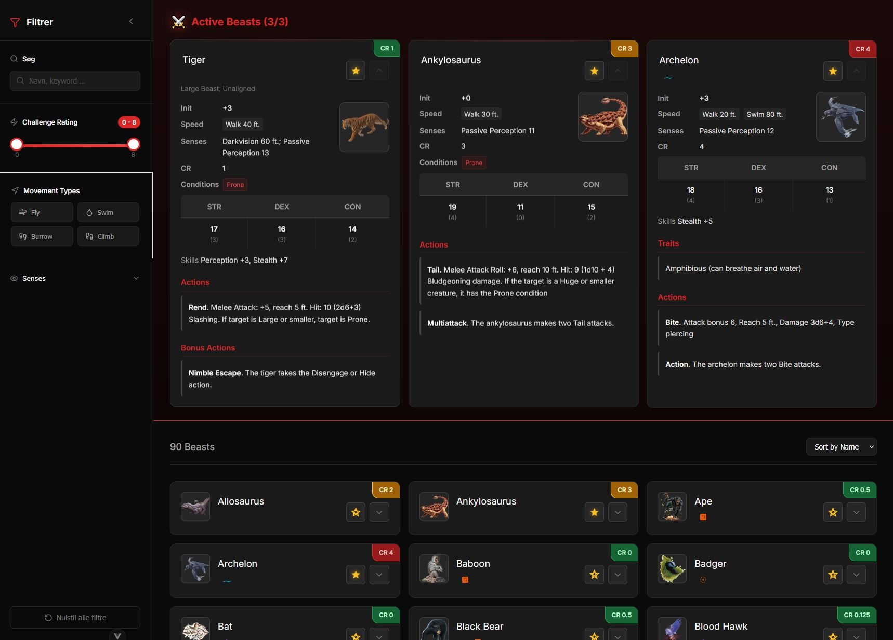
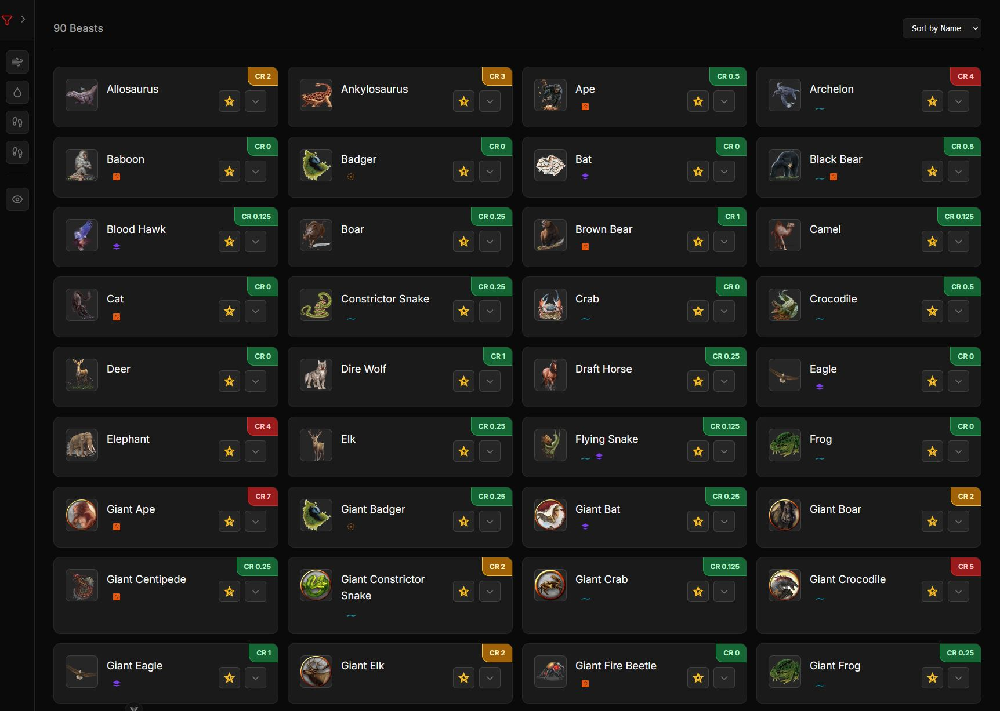
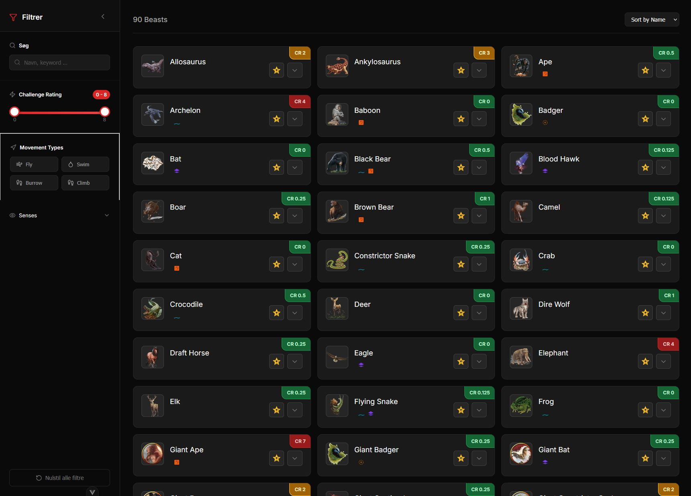

# 🐺 Druid Beast Companion App

A modern Vue.js application for browsing, filtering, and managing D&D 5e beasts for druids and other nature lovers.


## ✨ Features

- 🔍 **Advanced search**: Search by name, keywords, and abilities
- 📊 **Challenge Rating filter**: Adjust CR range with a beautiful slider
- 🏃‍♂️ **Movement types**: Filter by fly, swim, burrow, climb
- 👁️ **Senses**: Filter by blindsight, darkvision, tremorsense
- ⭐ **Favorites**: Mark up to 3 active beasts as favorites
- 📱 **Responsive design**: Works perfectly on desktop and mobile
- 🌙 **Dark mode support**: Automatic adaptation to system theme
- 💾 **Persistent filters**: Your settings are saved automatically

## 🚀 Quick Start

### Prerequisites

- Node.js 18+
- npm or yarn

### Installation

```bash
# Clone the repository
git clone https://github.com/username/druid-app.git
cd druid-app

# Install dependencies
npm install

# Start development server
npm run dev
```

Open [http://localhost:5173](http://localhost:5173) in your browser.

## 📁 Project Structure

```
druid-app/
├── src/
│   ├── components/
│   │   ├── ui/              # Reusable UI components
│   │   ├── BeastCard.vue    # Beast display component
│   │   └── FilterSidebar.vue # Filter interface
│   ├── stores/
│   │   ├── useFilters.js    # Pinia store for filters
│   │   └── activeBeasts.js  # Active beasts state
│   ├── views/
│   │   └── HomeView.vue     # Main page
│   └── assets/
│       └── beasts.json      # D&D 2024 beasts data
├── beast_images/            # Beast images (.webp)
├── 5etools-img/            # Additional D&D images
└── public/                 # Static files
```

## 🎮 Usage

### Filtering Beasts

1. **Search**: Type names or keywords in the search field
2. **Challenge Rating**: Adjust max CR with the slider
3. **Movement**: Click chips for fly, swim, burrow, climb
4. **Senses**: Expand "Senses" and select relevant senses

### Managing Active Beasts

- Click the ⭐ icon to add/remove beasts from active list
- Maximum 3 active beasts at a time
- Active beasts are displayed at the top of the page

### Responsive Design

- **Desktop**: Sidebar on the left, beast grid on the right
- **Mobile**: Floating action button opens filter panel

## 🛠️ Development

### Available Scripts

```bash
# Development server with hot reload
npm run dev

# Build for production
npm run build

# Preview production build
npm run preview

# Lint and fix code
npm run lint

# Format code with Prettier
npm run format
```

### Tech Stack

- **Framework**: Vue 3 with Composition API
- **Build Tool**: Vite
- **State Management**: Pinia
- **Styling**: Tailwind CSS + custom CSS
- **Icons**: Lucide Vue
- **Utilities**: VueUse
- **Data Persistence**: localStorage via VueUse

### Code Style

The project uses ESLint and Prettier for consistent code formatting:

```bash
# Auto-fix linting issues
npm run lint

# Format all files
npm run format
```

## 📊 Data

Beast data comes from D&D 2024 Player's Handbook and is normalized to a JSON format with:

- **Basic info**: Name, CR, AC, HP, speed
- **Stats**: STR, DEX, CON, INT, WIS, CHA
- **Abilities**: Senses, immunities, resistances
- **Attacks**: Name, bonus, damage, description

## 🔧 Configuration

### Customize Filters

Edit `src/stores/useFilters.js` to add new filter types or adjust existing ones.

### Add New Beasts

Update `src/assets/beasts.json` with new creatures in the established format.

### Styling

- **Global styles**: See `src/style.css`
- **Component styles**: Scoped CSS in each `.vue` file
- **Tailwind**: `tailwind.config.js` for customization

## 🤝 Contributing

1. Fork the project
2. Create a feature branch (`git checkout -b feature/AmazingFeature`)
3. Commit your changes (`git commit -m 'Add some AmazingFeature'`)
4. Push to the branch (`git push origin feature/AmazingFeature`)
5. Open a Pull Request

## 📸 Screenshots

### Desktop View with Active Beasts



### Desktop View without Sidebar



### Desktop View without Active Beasts



## 📄 License

This project is licensed under the MIT License - see the [LICENSE](LICENSE) file for details.

## 🙏 Acknowledgments

- D&D 2024 data from Wizards of the Coast
- Beast images from 5etools
- Vue.js and ecosystem developers
- D&D community for inspiration

---

**Happy Beast Hunting!** 🐻🦅🐺
